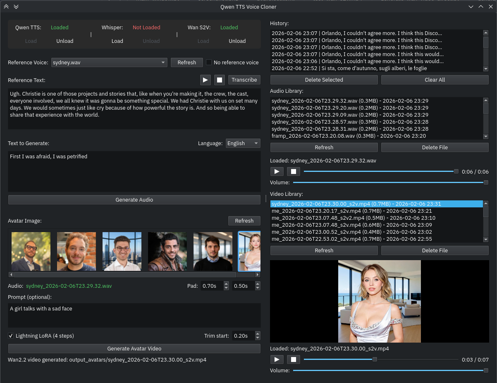

# Qwen TTS Voice Cloner UI

A PyQt6-based graphical interface for the Qwen TTS voice cloning system.



## Features

- **Auto-load model**: Model loads automatically on first generation
- **Voice selection**: Choose reference voices from the `voices/` directory
- **No reference mode**: Generate speech without voice cloning
- **Instructions control**: Control voice style, emotion, pace with natural language
- **Whisper transcription**: Transcribe reference audio using Whisper-Medium
- **History tracking**: All generations saved to history with one-click reload
- **Audio library**: Play back any generated audio with built-in player
- **Auto-naming**: Output files are saved as `VOICE_Timestamp.wav` in the `output/` directory

## Installation

Using uv (recommended):
```bash
uv sync
```

Or with pip:
```bash
pip install -e .
```

## Usage

### Using the command:
```bash
uv run tts-ui
```

Or if installed:
```bash
tts-ui
```

### Direct Python:
```bash
uv run python qwen_tts_ui.py
```

## How to Use

1. Place your reference voice WAV files in the `voices/` directory
2. Run the UI (see commands above)
3. Select a reference voice from the dropdown (or check "No reference voice")
4. If using reference voice: Enter or transcribe the reference text (what is said in the reference audio)
5. Optionally add instructions to control voice style (e.g., "slow, emotional, natural")
6. Select your target language
7. Enter the text you want to generate
8. Click "Generate Audio" - the model will auto-load if needed

The output will be saved in the `output/` directory and automatically play in the built-in audio player.

## Tips

- Click "Transcribe Reference Audio" to automatically transcribe the selected voice file
- The model auto-loads on first generation - no need to pre-load
- Click any history item to reload all settings from a previous generation
- Double-click audio files in the library to play them immediately
- Click "Refresh" to reload the voices list if you add new files while the app is running
- Use the "No reference voice" option to generate speech without voice cloning

## Project Structure

```
qwen-tts/
├── voices/          # Place reference voice WAV files here
├── output/          # Generated audio files appear here
├── qwen_tts_ui.py   # Main UI application
├── generate.py      # Original CLI generation script
└── pyproject.toml   # Project configuration
```
